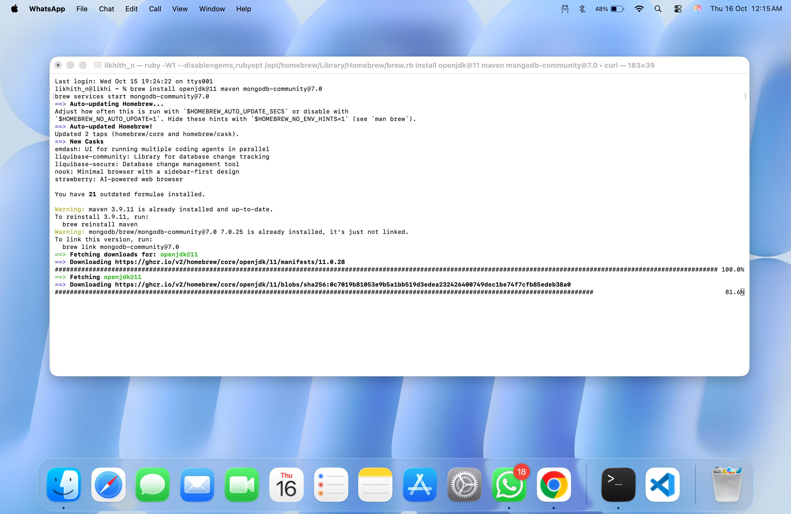
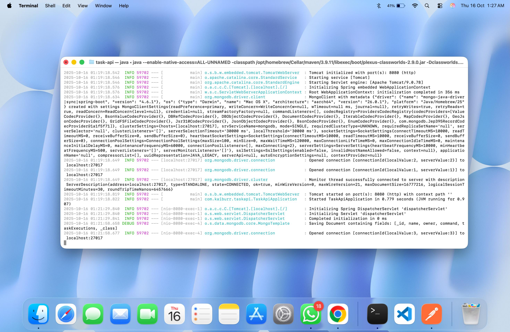
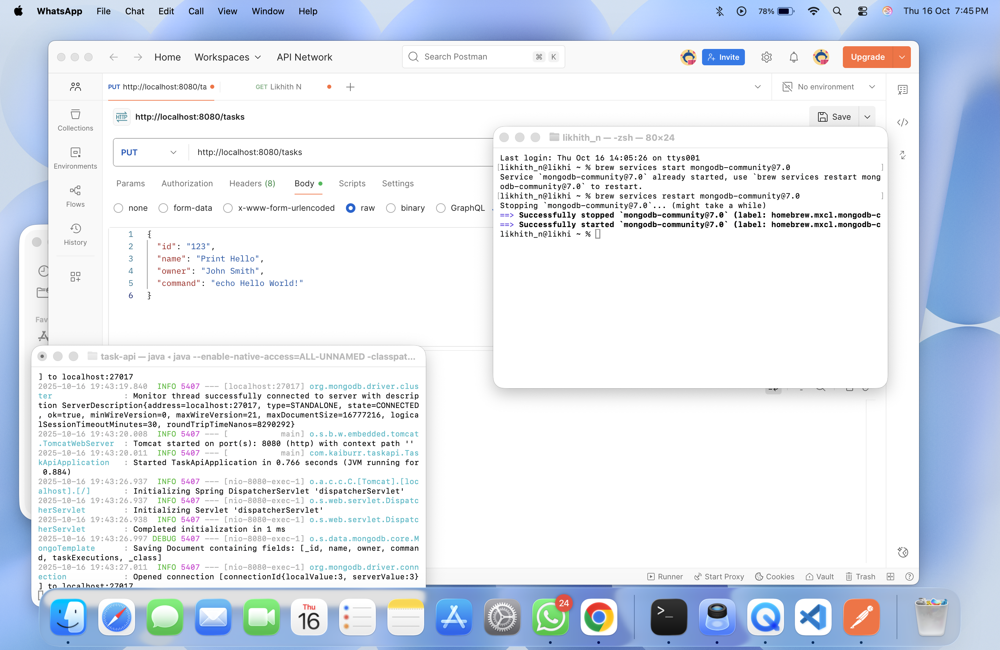
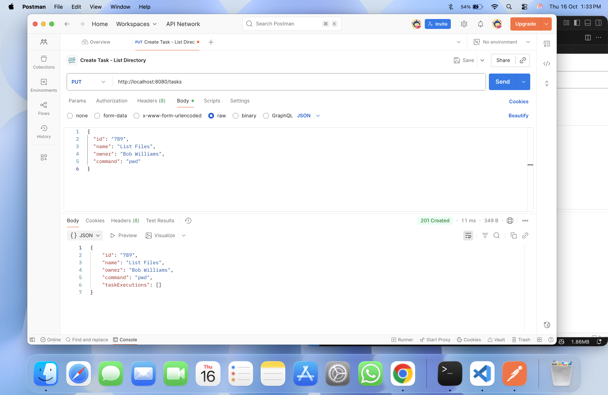
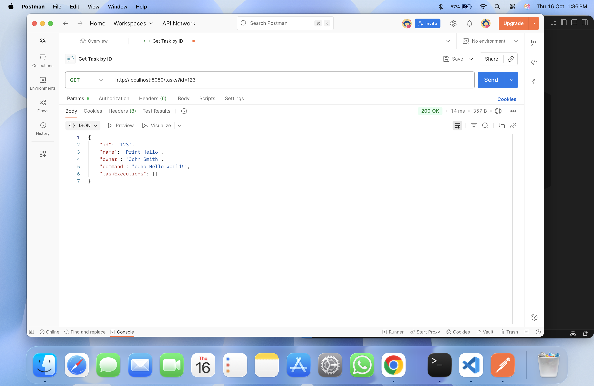
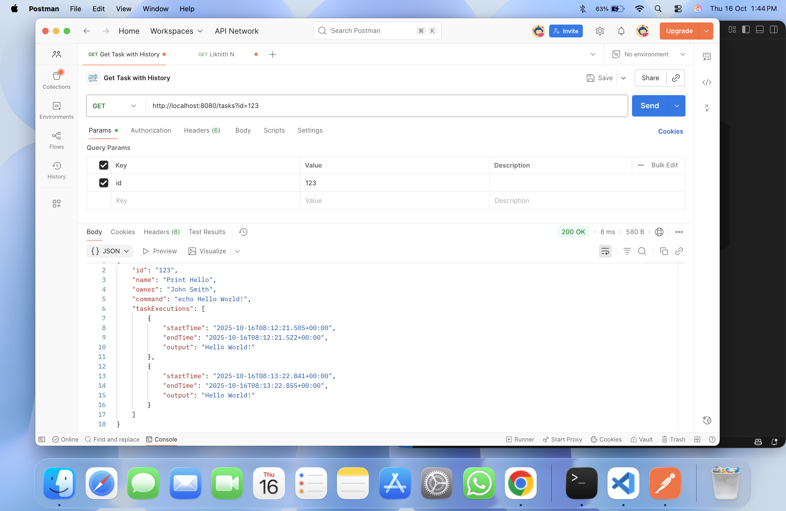
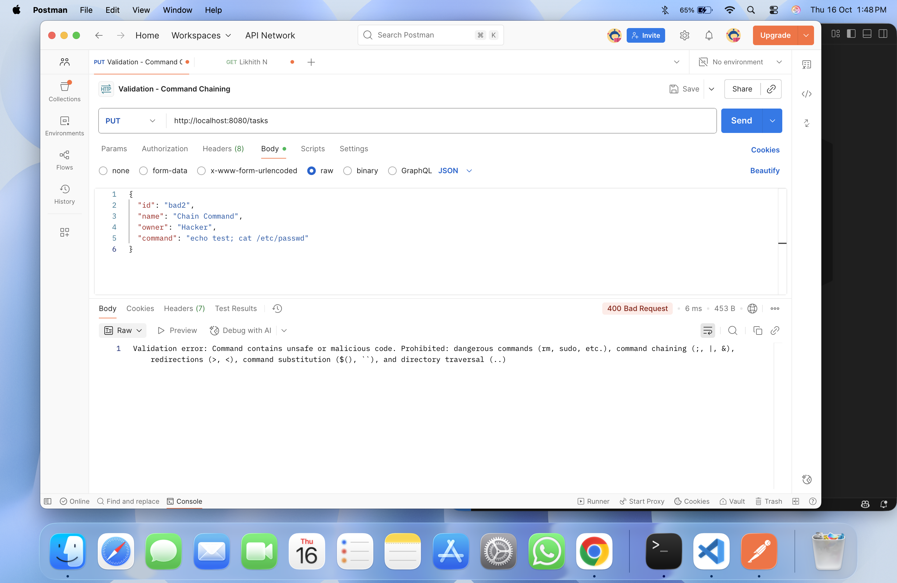
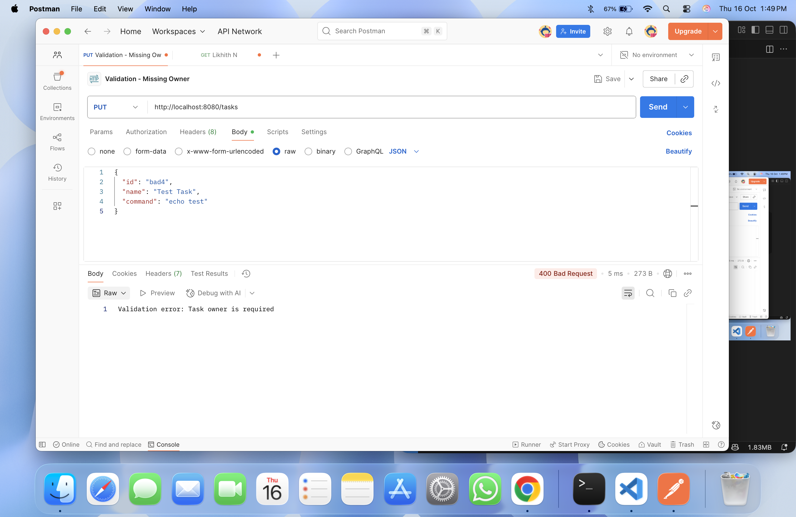
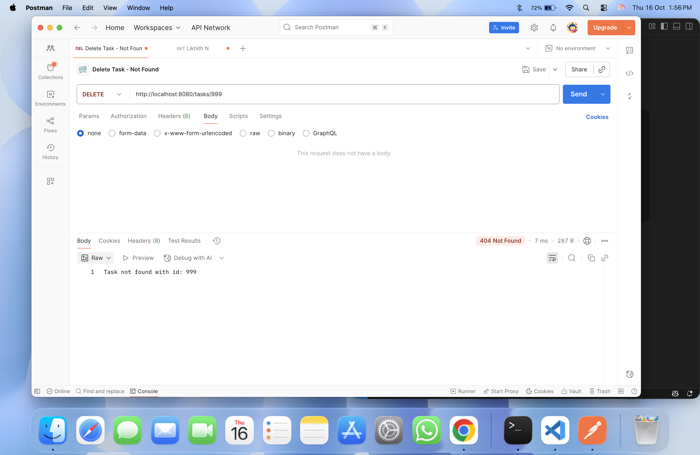

2Task Execution Manager
## Support_Snapshots - Supports for Configuration and installation.
## Test_Snapshots - Supports for Testing Edge Cases in Postman. (Tested with all edge cases)

# Introduction:
    A robust REST API built with Java Spring Boot that lets you easily create, manage, and execute shell command tasks in Kubernetes pods. It comes with task scheduling, execution history tracking, command validation, and strong security controls to ensure safe and reliable operation.

# Features:
    RESTful API for complete CRUD operations on tasks
    Shell Command Execution with output capture and error handling
    Execution History Tracking - maintains complete history of all task executions
    Command Security Validation - prevents execution of dangerous commands
    MongoDB Integration - persistent storage of tasks and execution history
    Comprehensive Error Handling - proper HTTP status codes and error messages
    Edge Case Coverage - handles missing fields, invalid data, and non-existent resources

# Technology Stack:
    Java 11
    Spring Boot 2.7.14
    Spring Data MongoDB
    Maven - Build and dependency management
    MongoDB - NoSQL database
    Postman - API testing

# Prerequisites:
    Java 11 or higher
    Maven 3.6+
    MongoDB 7.0+
    Postman (for API testing)

## Project Structure:
task-api/
├── pom.xml
├── src/
│   └── main/
│       ├── java/
│       │   └── com/
│       │       └── kaiburr/
│       │           └── taskapi/
│       │               ├── TaskApiApplication.java
│       │               ├── controller/
│       │               │   └── TaskController.java
│       │               ├── service/
│       │               │   └── TaskService.java
│       │               ├── repository/
│       │               │   └── TaskRepository.java
│       │               ├── model/
│       │               │   ├── Task.java
│       │               │   └── TaskExecution.java
│       │               └── util/
│       │                   └── CommandValidator.java
│       └── resources/
│           └── application.properties
├── Support_Snapshots/
│   └── (setup and installation images)
└── Test_Snapshots/
    └── (API testing screenshots)

# Step 1: One-Time Setup
#Open the terminal & Run this command to install Dependencies

brew install openjdk@11 maven mongodb-community@7.0

# STEP 2
#After successful installation, navigate into project folder:

cd task-api

# STEP 3
#Enter this command and click enter to run the application

mvn spring-boot:run

# STEP 4
#In the new terminal run this command and make sure MongoDB is running

brew services start mongodb-community@7.0

If you face any database-related issues, restart the MongoDB service:

brew services restart mongodb-community@7.0

#ALL DONE
#Your application should now be up and running successfully.
#To Test Application

# STEP 5
#Download and install Postman from the official site:
https://www.postman.com/downloads/ 

# DATA MODELS:

        Task Object:

                {
            "id": "string",
            "name": "string",
            "owner": "string",
            "command": "string",
            "taskExecutions": [
                {
                "startTime": "date",
                "endTime": "date",
                "output": "string"
                }
            ]
            }

        TaskExecution Object:

                {
                "startTime": "2025-10-16T15:45:23.123Z",
                "endTime": "2025-10-16T15:45:24.456Z",
                "output": "Command output text"
                }

# STEP 6
#Open Postman

Create a new Collection:
    Click "Collections" in left sidebar
    Click "+" or "New Collection"
    Name it: "Kaiburr Task API Tests"

# TEST CASES:

    Test Case 1: Create Task - Print Hello
    Request:
        Method: PUT
        URL: http://localhost:8080/tasks
        Body: 
            {
                "id": "123",
                "name": "Print Hello",
                "owner": "John Smith",
                "command": "echo Hello World!"
            }
Expected Response: 201 Created

*****************************************************************
    Test Case 2: Create Task - Show Date
    Request:
        Method: PUT
        URL: http://localhost:8080/tasks
        Body:
            {
                "id": "456",
                "name": "Show Current Date",
                "owner": "Alice Johnson",
                "command": "date"
            }
Expected Response: 201 Created

*****************************************************************
    Test Case 3: Create Task - List Directory
    Request:

        Method: PUT
        URL: http://localhost:8080/tasks
        Body:
            {
                "id": "789",
                "name": "List Files",
                "owner": "Bob Williams",
                "command": "pwd"
            }
Expected Response: 201 Created

*****************************************************************
    Test Case 4: Get All Tasks
    Request:
            Method: GET
            URL: http://localhost:8080/tasks
Expected Response: 200 OK with array of all tasks

*****************************************************************
    Test Case 5: Get Task by ID
    Request:
            Method: GET
            URL: http://localhost:8080/tasks?id=123
Expected Response: 200 OK with single task object

*****************************************************************
    Test Case 6: Get Task by ID - Not Found
    Request:
            Method: GET
            URL: http://localhost:8080/tasks?id=999
Expected Response: 404 Not Found

*****************************************************************
    Test Case 7: Search Tasks by Name
    Request:
            Method: GET
            URL: http://localhost:8080/tasks/search?name=Hello
Expected Response: 200 OK with matching tasks

*****************************************************************
    Test Case 8: Search Tasks - No Results
    Request:
            Method: GET
            URL: http://localhost:8080/tasks/search?name=XYZNotFound
Expected Response: 404 Not Found

*****************************************************************
    Test Case 9: Execute Task - First Time
    Request:
            Method: PUT
            URL: http://localhost:8080/tasks/123/execute
Expected Response: 200 OK with execution details (startTime, endTime, output)

*****************************************************************
    Test Case 10: Execute Task - Second Time
    Request:
            Method: PUT
            URL: http://localhost:8080/tasks/123/execute
Expected Response: 200 OK with execution details   

*****************************************************************
    Test Case 11: Get Task with Execution History
    Request:
            Method: GET
            URL: http://localhost:8080/tasks?id=123
Expected Response: 200 OK with task containing multiple executions in taskExecutions array

Note: This demonstrates the execution history tracking feature, showing all previous executions of the task.

*****************************************************************
    Test Case 12: Execute Non-Existent Task
    Request:
            Method: PUT
            URL: http://localhost:8080/tasks/999/execute
Expected Response: 404 Not Found

*****************************************************************
    Test Case 13: Validation - Unsafe Command
    Request:
            Method: PUT
            URL: http://localhost:8080/tasks
            Body:
                {
                "id": "bad1",
                "name": "Dangerous Task",
                "owner": "Hacker",
                "command": "rm -rf /"
            }
Expected Response: 400 Bad Request with validation error message

Note: This demonstrates the security validation feature that prevents execution of dangerous commands.

*****************************************************************
    Test Case 14: Validation - Command Chaining
    Request:
            Method: PUT
            URL: http://localhost:8080/tasks
            Body:
                {
                "id": "bad2",
                "name": "Chain Command",
                "owner": "Hacker",
                "command": "echo test; cat /etc/passwd"
            }
Expected Response: 400 Bad Request

*****************************************************************
    Test Case 15: Validation - Missing Name
    Request:
            Method: PUT
            URL: http://localhost:8080/tasks
            Body:
                {
                    "id": "bad3",
                    "owner": "Test User",
                    "command": "echo test"
                }
Expected Response: 400 Bad Request - "Task name is required"

*****************************************************************
    Test Case 16: Validation - Missing Owner
    Request:
            Method: PUT
            URL: http://localhost:8080/tasks
            Body:
                {
                    "id": "bad4",
                    "name": "Test Task",
                    "command": "echo test"
                }
Expected Response: 400 Bad Request - "Task owner is required"

*****************************************************************
    Test Case 17: Validation - Empty Command
    Request:
            Method: PUT
            URL: http://localhost:8080/tasks
            Body:
                {
                    "id": "bad5",
                    "name": "Empty Command",
                    "owner": "Test User",
                    "command": ""
                }
Expected Response: 400 Bad Request - "Command cannot be empty"

*****************************************************************
    Test Case 18: Delete Task
    Request:
            Method: DELETE
            URL: http://localhost:8080/tasks/789
Expected Response: 200 OK - "Task deleted successfully"

*****************************************************************
    Test Case 19: Delete Non-Existent Task
    Request:
            Method: DELETE
            URL: http://localhost:8080/tasks/999
Expected Response: 404 Not Found

*****************************************************************
    Test Case 20: Verify Deletion
    Request:
            Method: GET
            URL: http://localhost:8080/tasks?id=789
Expected Response: 404 Not Found - Confirms the task was successfully deleted

*****************************************************************

# Security Features:
    Dangerous Commands:
                rm, rmdir, del - File deletion commands
                sudo, su - Privilege escalation
                chmod, chown - Permission modifications
                wget, curl - Network downloads
                kill, shutdown, reboot - System control commands
    
    Dangerous Patterns:
                Command chaining: ;, |, &, &&, ||
                Command substitution: $(), ` (backticks)
                File redirection: >, <, >>
                Directory traversal: ../
                Escape sequences: \

Validation Examples:
    Safe Commands:
            echo "Hello World"
            date
            pwd
            whoami
            hostname

    Blocked Commands:
            rm -rf /
            sudo echo test
            echo test; cat /etc/passwd
            cat file > output.txt
            cd ../../../etc

# Troubleshooting:
    MongoDB Connection Issues:
                        # Check if MongoDB is running
                        brew services list

                        # Restart MongoDB
                        brew services restart mongodb-community@7.0

                        # Check MongoDB logs
                        tail -f /opt/homebrew/var/log/mongodb/mongo.log
                
    Port 8080 Already in Use:
                        # Find process using port 8080
                        lsof -i :8080

                        # Kill the process
                        kill -9 <PID>

    Application Won't Start:
                        # Verify Java version
                        java -version

                        # Clean and rebuild
                        mvn clean install -U

                        # Check MongoDB connection
                        mongosh

# Testing with cURL:
            # Create a task
            curl -X PUT http://localhost:8080/tasks \
            -H "Content-Type: application/json" \
            -d '{"id":"1","name":"Test","owner":"Me","command":"echo Hello"}'

            # Get all tasks
            curl -X GET http://localhost:8080/tasks

            # Execute a task
            curl -X PUT http://localhost:8080/tasks/1/execute

            # Delete a task
            curl -X DELETE http://localhost:8080/tasks/1

# ₹ 567tyghb 9opl.Learning Outcomes:
    RESTful API design principles
    Spring Boot application development
    MongoDB integration with Spring Data
    Input validation and security best practices
    Error handling and HTTP status codes
    Shell command execution in Java
    Comprehensive API testing
    Documentation best practices

## License
This project is part of the Kaiburr assessment and is for educational purposes.

## Author
**Likhith Nagaraj**  
- [GitHub](https://github.com/likhithnagaraj79)  
- [LinkedIn](https://www.linkedin.com/in/likhith-nagaraj-79-avv/)

## Acknowledgments
- Kaiburr LLC for the project requirements  
- Spring Boot community for excellent documentation  
- MongoDB for robust NoSQL database solution

---
Built using Java, Spring Boot, and MongoDB